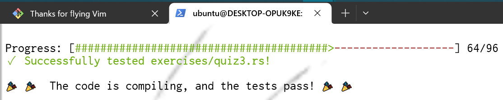

# rustlings 🦀❤️

## Abst

- `rust` のインタラクティブ形式な演習問題集
- 一問一問ACが表示されて，競プロみたいで楽しい

- 問題一覧は [exercises](./exercises/) ディレクトリ
- 解く時は，[the book](https://doc.rust-lang.org/book/title-page.html) や，[the book (ja)](https://doc.rust-jp.rs/book-ja/title-page.html)，[example (ja)](https://doc.rust-jp.rs/rust-by-example-ja/index.html) などを適宜参照する
- 使い方など詳しくは [オリジナル（Fork元）のREADME](./docs/README.original.md) を参照

## Status

| Exercise              | Solved |
| --------------------- | ------ |
| variables             | o |
| functions             | o |
| if                    | o |
| primitive_types       | o |
| vecs                  | o |
| move_semantics        | o |
| structs               | o |
| enums                 | o |
| strings               | o |
| modules               | o |
| hashmaps              | o |
| options               | o |
| error_handling        | o |
| generics              | o |
| traits                | o |
| tests                 | - |
| lifetimes             | - |
| iterators             | - |
| threads               | - |
| smart_pointers        | - |
| macros                | - |
| clippy                | - |
| conversions           | - |
| quiz 1                | o |
| quiz 2                | o |
| quiz 3                | o |

## Fork元のLicense

- MIT
- forked from [rust-lang/rustlings](https://github.com/rust-lang/rustlings)
